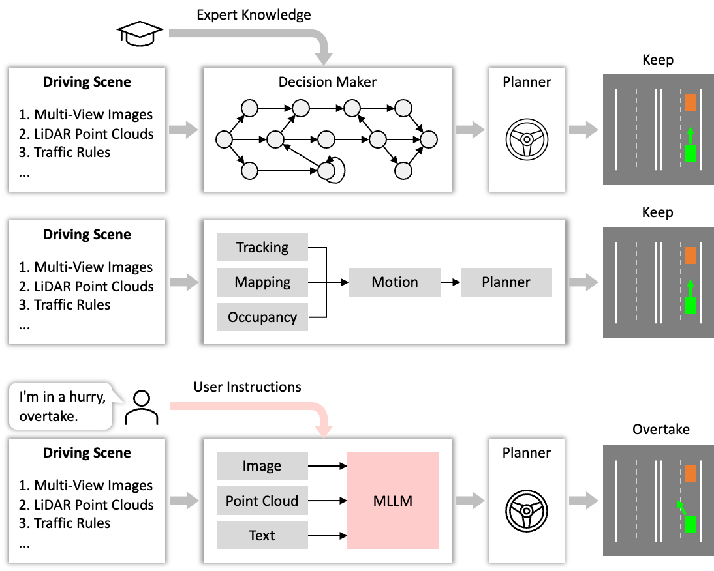
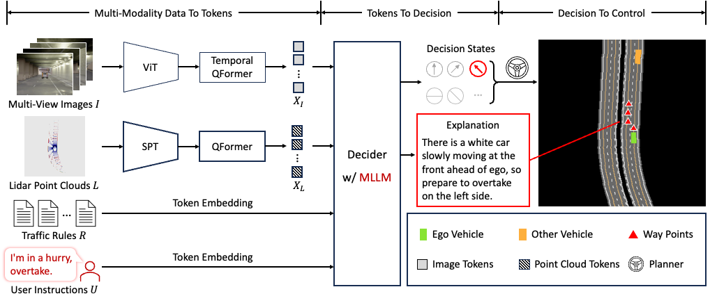
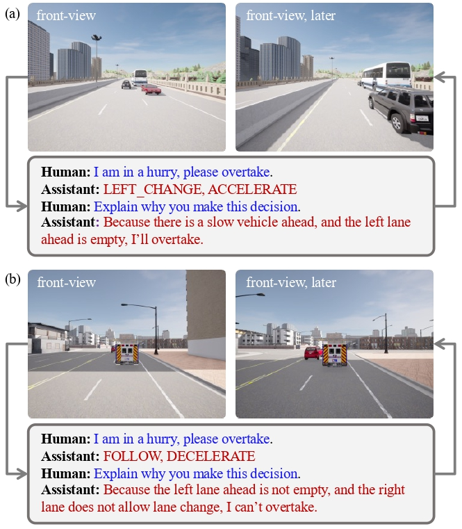
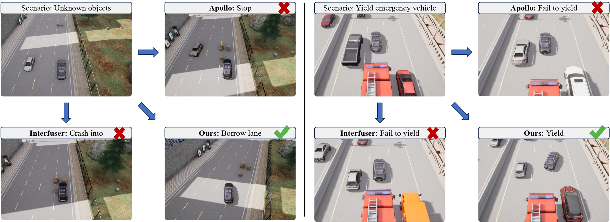
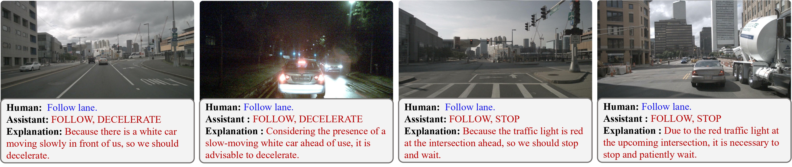

# DriveMLM


<!-- ## Description -->

Large language models (LLMs) have opened up new possibilities for intelligent agents, endowing them with human-like thinking and cognitive abilities. In this work, we delve into the potential of large language models (LLMs) in autonomous driving (AD). We introduce DriveMLM, an LLM-based AD framework that can perform close-loop autonomous driving in realistic simulators. To this end, (1) we bridge the gap between the language decisions and the vehicle control commands by standardizing the decision states according to the off-the-shelf motion planning module. (2) We employ a multi-modal LLM (MLLM) to model the behavior planning module of a module AD system, which uses driving rules, user commands, and inputs from various sensors (\eg, camera, lidar) as input and makes driving decisions and provide explanations; This model can plug-and-play in existing AD systems such as Apollo for close-loop driving. (3) We design an effective data engine to collect a dataset that includes decision state and corresponding explanation annotation for model training and evaluation. We conduct extensive experiments and show that our model achieves 76.1 driving score on the CARLA Town05 Long, and surpasses the Apollo baseline by 4.7 points under the same settings, demonstrating the effectiveness of our model. We hope this work can serve as a baseline for autonomous driving with LLMs.



## 🗓️ Schedule
- [ ] Release dataset and annotations
- [ ] Release code and models

## 🏠 Overview


## 🎁 Major Features 
* Following human instruction. <br>  <br>
* Handling more scenarios. <br>  <br>
* Examples on nuScenes. <br>  <br>

## 🎫 License

This project is released under the [Apache 2.0 license](LICENSE). 

## 🖊️ Citation

If you find this project useful in your research, please consider cite:

```BibTeX
@article{anonymousdrivemlm,
  author    = {Anonymous},
  title     = {DriveMLM: Aligning Multi-Modal Large Language Models with Behavioral Planning States for Autonomous Driving},
  journal   = {Under Review},
  year      = {2023},
}
```
